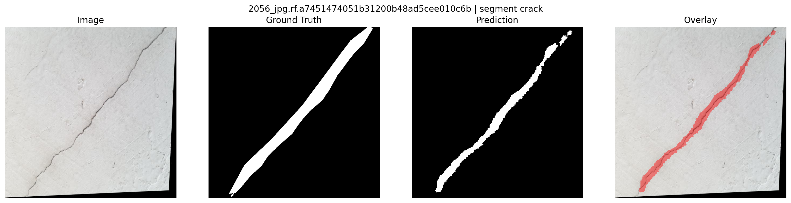
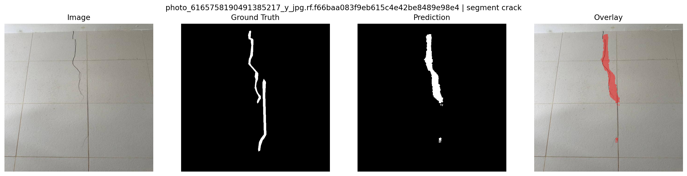
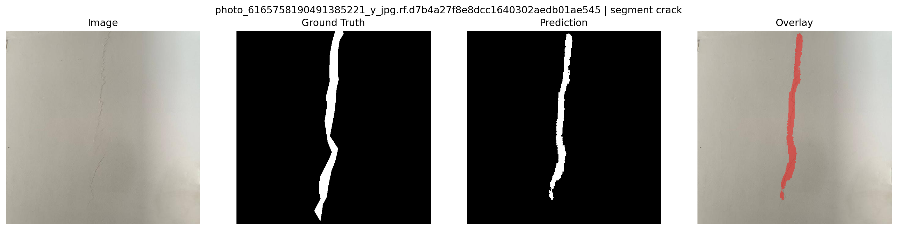
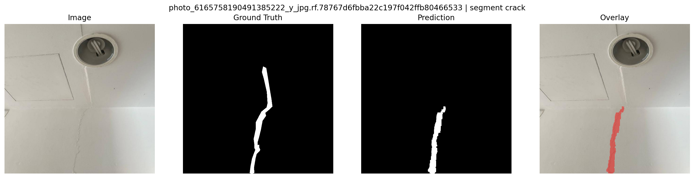
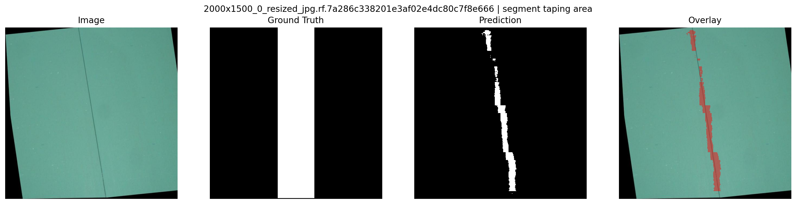
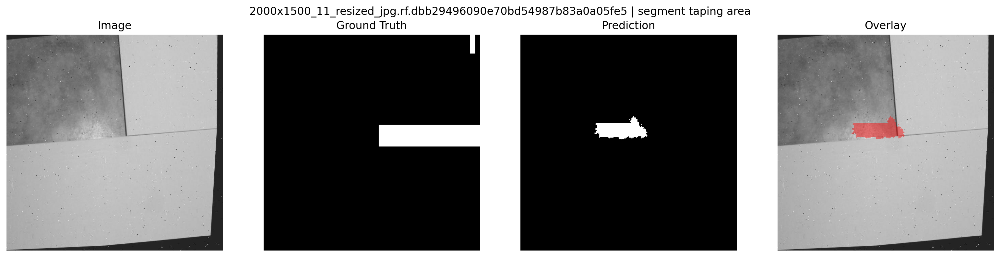
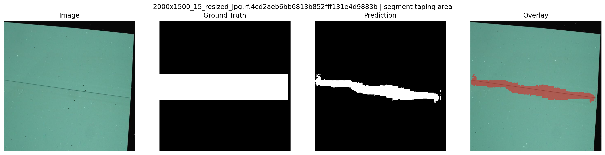
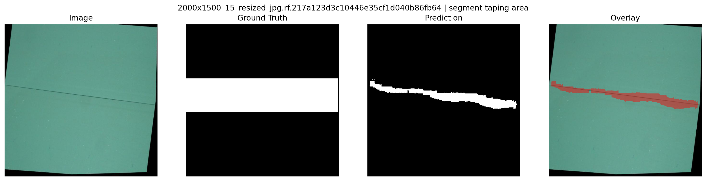

# Text-Conditioned Segmentation of Cracks and Drywall Taping Areas

## Goal

The goal of this project is to fine-tune a text-conditioned segmentation model so that, given an input image and a natural-language prompt, it produces a binary segmentation mask for:

- `"segment crack"` → cracks
- `"segment taping area"` → drywall seams / taping areas

The model outputs a **single-channel binary PNG mask** with:

- the same spatial size as the source image
- values in `{0, 255}`
- filename format: `<image_id>__<prompt>.jpg`

**Example:**
```
123__segment_crack.jpg
```

---

## Approach

### Model

I fine-tuned the **CLIPSeg** model:

> [`CIDAS/clipseg-rd64-refined`](https://huggingface.co/CIDAS/clipseg-rd64-refined)

CLIPSeg is a vision-language segmentation model that combines:

- CLIP image encoder
- CLIP text encoder
- segmentation decoder head

The model takes both an image and a text prompt, and predicts a segmentation mask conditioned on the prompt.

### Training Setup

Each training sample consists of:

```
(image, prompt, mask)
```

The model was trained jointly on two datasets:

| Dataset | Task |
|---|---|
| Drywall-Join-Detect | `segment taping area` |
| Cracks | `segment crack` |

### Hyperparameters

| Parameter | Value |
|---|---|
| Model | CLIPSeg (rd64 refined) |
| Loss | `BCEWithLogitsLoss` |
| Optimizer | AdamW |
| Learning rate | `1e-5` |
| Batch size | `32` |
| Epochs | `10` |
| Random seed | `42` |
| Device | GPU |

### Prompt Augmentation

During training, prompt augmentation was used by sampling from multiple prompt variants. (the augmented prompts are suggested by the chatgpt. Later Can multiple augmentation s from local LLM model.)

**Crack prompts**
- `segment crack`
- `segment wall crack`
- `segment surface crack`
- `segment drywall crack`
- `segment structural crack`

**Drywall prompts**
- `segment taping area`
- `segment drywall seam`
- `segment joint tape`
- `segment drywall joint`
- `segment drywall tape`

During validation, **fixed canonical prompts** were used for consistent evaluation.

| Task | Prompt |
|---|---|
| Cracks | `segment crack` |
| Drywall | `segment taping area` |

---

## Datasets
 
> The two datasets use different annotation formats. Drywall labels use **YOLO bounding boxes** (5 values per line), while Crack labels use **YOLO segmentation polygons** (7+ values per line). The `_label_to_mask` function in `dataset.py` handles both formats automatically, dispatching on the number of values per line.
 
### Dataset 1 — Drywall Taping Area
 
**Source:**
> https://universe.roboflow.com/objectdetect-pu6rn/drywall-join-detect
 
**Target concept:**
- `segment taping area`
- `segment drywall seam`
 
#### Annotation Format
 
This dataset provides **YOLO detection annotations** (bounding boxes), not segmentation masks.
 
Each label line contains 5 values:
 
```
class  center_x  center_y  width  height
```
 
All coordinates are normalized to `[0, 1]`. Bounding boxes are converted into segmentation masks by computing pixel coordinates and rasterizing each box as a filled rectangle:
 
```python
x1 = int(max(0, round(x_center - box_w / 2)))
y1 = int(max(0, round(y_center - box_h / 2)))
x2 = int(min(width, round(x_center + box_w / 2)))
y2 = int(min(height, round(y_center + box_h / 2)))
 
mask[y1:y2, x1:x2] = 1
```
 
> ⚠️ Because the drywall seam occupies only a thin portion of the bounding box, this introduces label noise — the mask covers a larger area than the actual seam.
 
---
 
### Dataset 2 — Cracks
 
**Source:**
> https://universe.roboflow.com/fyp-ny1jt/cracks-3ii36
 
**Target concept:**
- `segment crack`
- `segment wall crack`
 
#### Annotation Format
 
This dataset provides **YOLO segmentation annotations** (polygon masks).
 
Each label line contains 7 or more values:
 
```
class  x1 y1  x2 y2  x3 y3  ...
```
 
All coordinates are normalized to `[0, 1]`. Polygons are denormalized to pixel space and rasterized into binary masks using:
 
```python
points = np.array([[int(x * width), int(y * height)] for x, y in pairs], dtype=np.int32)
cv2.fillPoly(mask, [points], 1)
```
 
A minimum of 3 points is required to form a valid polygon.
 
---

### Dataset Split

| Dataset | Train | Validation |
|---|---|---|
| Drywall | `820` | `202` |
| Cracks | `5164` | `201` |

Training uses the **combined training split** from both datasets.

Validation metrics are computed **separately per task**.

---

## Evaluation Metrics

Two metrics were used for evaluation.

**Intersection over Union (IoU)**
```
IoU = intersection / union
```

**Dice Coefficient**
```
Dice = 2 * intersection / (prediction + ground_truth)
```

Metrics are computed on the validation set.

---

## Results
 
All metrics are logged to TensorBoard under `runs/` and can be viewed with:
 
```bash
tensorboard --logdir runs/
```
 
The best model checkpoint is saved to `checkpoints/` whenever the **macro Dice** score improves across epochs.
 
### Logged TensorBoard Keys
 
**Training (per batch):** `train/batch_loss`, `train/batch_iou`, `train/batch_dice`, `train/lr`
 
**Training (per epoch):** `train/epoch_loss`, `train/epoch_iou`, `train/epoch_dice`
 
**Validation (per epoch):**
- `val/cracks_loss`, `val/cracks_iou`, `val/cracks_dice`
- `val/drywall_loss`, `val/drywall_iou`, `val/drywall_dice`
- `val/macro_loss`, `val/macro_iou`, `val/macro_dice`
 
**Samples (per epoch, one image per task):** `samples/{cracks|drywall}_image`, `samples/{cracks|drywall}_pred_mask`, `samples/{cracks|drywall}_gt_mask`
 
**Runtime:** `runtime/train_time_seconds`

### Final Validation Scores
 
> Replace the placeholders below with values from TensorBoard (`val/` keys at the best epoch).
 
| Task | Prompt | IoU | Dice |
|---|---|---|---|
| Cracks | `segment crack` | `0.4501` | `.5984` |
| Drywall | `segment taping area` | `0.977` | `0.977` |
| **Macro Average** | — | `0.7139` | `0.7828` |
 
---

## Visual Examples


### Cracks

`Image | Ground Truth | Prediction`






### Drywall

`Image | Ground Truth | Prediction | Overlay`






> Overlay visualizations highlight predicted masks on top of the original image.

---

## Qualitative Observations

### Successful cases

- The model successfully segments **thin crack structures**.
- Drywall seams are often detected as **thin linear structures**.

### Interesting behavior

The model sometimes segments drywall seams even when prompted with `segment crack`.

This happens because cracks and drywall seams share similar visual features (thin linear structures on walls), and CLIP-style text embeddings place semantically related prompts close in representation space.

### Failure cases

| Failure Type | Description |
|---|---|
| Bounding box supervision noise | Drywall masks are derived from bounding boxes, which cover a larger region than the actual seam |
| Very thin cracks | Extremely thin cracks may be partially missed |
| Low contrast surfaces | Cracks that blend into wall textures are harder to detect |

---

## Runtime and Model Footprint

Training time is automatically logged to TensorBoard under `runtime/train_time_seconds` at the end of training.

| Metric | Value |
|---|---|
| Training time | `1313.02` |
| Avg inference time / image | `117.3 ms` |
| Model checkpoint size | `612 mb` |

> **Notes:**
> - Inference should be measured with batch size = 1
> - Specify whether timing is on CPU or GPU

---

## Reproducibility

Random seeds were fixed:

```python
seed = 42
```

Applied to:
- `random`
- `numpy`
- `torch`

---

## Repository Structure

```
.
├── train.py
├── dataset.py
├── export_predictions.py
├── report_figure_grid.py
├── inference.py
├── checkpoints/
├── predictions/
├── figures/
├── data/
├── docs/
├── runs/
└── README.md
```

---

## How to Run

## How to Run
 
### Training
 
**Basic run (default hyperparameters):**
 
```bash
python train.py
```
 
**Custom hyperparameters:**
 
```bash
python train.py \
  --batch-size 32 \
  --num-epochs 10 \
  --lr 1e-5 \
  --seed 42 \
  --save-dir checkpoints
```
 
**With Weights & Biases tracking:**
 
```bash
python train.py \
  --batch-size 32 \
  --num-epochs 10 \
  --track True \
  --wandb-project-name PromptSeg \
  --wandb-entity <your-entity>
```
 
**All available flags:**
 
| Flag | Default | Description |
|---|---|---|
| `--exp-name` | `train` | Experiment name used in run name and checkpoint filename |
| `--arch` | `CLIPSeg` | Architecture label used in run name |
| `--seed` | `42` | Random seed for `random`, `numpy`, `torch` |
| `--cuda` | `True` | Use GPU if available |
| `--batch-size` | `32` | Batch size for training and validation |
| `--num-epochs` | `10` | Number of training epochs |
| `--lr` | `1e-5` | Learning rate for AdamW optimizer |
| `--num-workers` | `4` | DataLoader worker processes |
| `--log-every` | `10` | Print batch-level loss every N steps |
| `--save-dir` | `checkpoints/` | Directory to save the best checkpoint |
| `--track` | `False` | Enable Weights & Biases logging |
| `--wandb-project-name` | `PromptSeg` | W&B project name (requires `--track True`) |
| `--wandb-entity` | `None` | W&B entity / team (requires `--track True`) |
 
**Checkpoint naming:**
 
The best checkpoint is saved whenever macro Dice improves, using the following naming convention:
 
```
checkpoints/{exp_name}__{arch}__seed{seed}__{unix_timestamp}_best.pt
```
 
Example:
```
checkpoints/train__CLIPSeg__seed42__1773259795_best.pt
```
 
**Monitor training in TensorBoard:**
 
```bash
tensorboard --logdir runs/
```

### Export Predictions
 
**Cracks**
```bash
python export_predictions.py \
  --checkpoint checkpoints/best.pt \
  --input-dir data/cracks.v1i.yolov8/valid/images \
  --output-dir predictions/cracks \
  --prompt "segment crack"
```
 
**Drywall**
```bash
python export_predictions.py \
  --checkpoint checkpoints/best.pt \
  --input-dir data/Drywall-Join-Detect.v1i.yolov8/valid/images \
  --output-dir predictions/drywall \
  --prompt "segment taping area"
  ```

### Generate Figures
 
Each figure is saved as a **4-panel image**: `Image | Ground Truth | Prediction | Overlay`.
 
The overlay panel blends the predicted mask on top of the original image using a translucent color. Overlay color and opacity are configurable via `--overlay-color` and `--overlay-alpha`.
 
**Cracks**
```bash
python visualize.py \
  --images-dir data/cracks.v1i.yolov8/valid/images \
  --labels-dir data/cracks.v1i.yolov8/valid/labels \
  --pred-dir predictions/cracks \
  --prompt "segment crack" \
  --output-dir figures/cracks \
  --overlay-color red \
  --overlay-alpha 0.45
```
 
**Drywall**
```bash
python report_figure_grid.py \
  --images-dir data/Drywall-Join-Detect.v1i.yolov8/valid/images \
  --labels-dir data/Drywall-Join-Detect.v1i.yolov8/valid/labels \
  --pred-dir predictions/drywall \
  --prompt "segment taping area" \
  --output-dir figures/drywall \
  --overlay-color red \
  --overlay-alpha 0.45
```

Available flags:
 
| Flag | Default | Description |
|---|---|---|
| `--images-dir` | — | Directory with source images |
| `--labels-dir` | — | Directory with YOLO label `.txt` files |
| `--pred-dir` | — | Directory with predicted PNG masks |
| `--output-dir` | `visualize` | Directory to save output figures |
| `--prompt` | `segment crack` | Prompt used during prediction |
| `--max-images` | `4` | Maximum number of figures to save |
| `--overlay-alpha` | `0.45` | Opacity of the mask overlay (`0.0`–`1.0`) |
| `--overlay-color` | `red` | Overlay color: `red`, `green`, `blue`, `yellow` |